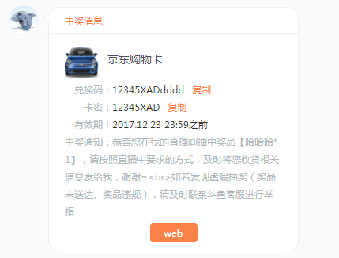

# [react]复制功能组件实现

------
`JavaScript` `React` `copy` `component` 
站内信目前有个需求，设计了一种可后台配置带复制功能的消息格式



当用户点击复制按钮，将会把左边的对应的兑换码或卡密复制到剪切版中

* 思路
    * 由于`textObject.select()`方法和目前尚未普及的`selectionDirection`方法(不支持`IE`)仅支持取`type`为`text`, `search`, `URL`, `tel` and `password`的`input`元素的值,其它元素无法实现复制功能，这种模式显然不适合需求实现，此插件就是为解决此问题而设计。
    * 当用户初次激活使用复制功能时，在页面中创建一个`input`标签，由于复制功能是该标签要获得焦点，所以该标签样式属性要满足一下几点
        * 该标签的**display**不能为 **none**
        * 该标签的**visibility**属性不能为 **hidden**
        * 在**chrome**浏览器中 该标签的 **width** 不能为 **0**，否则chrome会默认选中的文本为空
        * 在**搜狗浏览器**中 该标签的  **width** 和 **height** 都不能为 **0**，否则浏览器会默认选中文本为空

* 浏览器支持：兼容 **IE9+**及其它高级浏览器

* HTML代码结构：

```javascript
    //引用
    import {IELessThanVer} from 'constants/constants'
    import Replication from 'lib/replication/Replication'

    dyField.map(function(elem,index){
        cont.push(
            <dl key={index}> // react涉及到的循环中，每个子对象都应该有对应的key值，否则浏览器会报 Each child in an array or iterator should have a unique "key" prop.
                <dt>{elem.Key}：</dt>
                <dd>{elem.Val}</dd>
                {!IELessThanVer(8) && elem.Copy && (elem.Copy === 1) ?
                <dd className="copy" onClick = {()=>Replication({
                    value : elem.Val,
                    fail(){
                       Toast.notice("复制失败，请手动复制"); 
                    }
                })}>复制</dd> :""
                } 　　
            </dl>
        )
    }) 
    
    /*************dyField数据格式*****************/
    dyField = [
        {
            Copy:1,
            Key:"兑换码",
            Val:"12345XADdddd"
        },
        {
            Copy:1,
            Key:"卡密",
            Val:"12345XAD"
        },
        {
            Copy:0,
            Key:"有效期",
            Val:"2017.12.23 23:59之前"
        }
    ]
    
```
* 具体实现：

```javascript
/**
 * des : copy method of react
 * Browser compatibility: IE9+
 * @param  {[obj]} externalConfig
 *     value        [The value to copy]
 *     cutOutLength [The length of the intercept(default:check all)] -Optional  
 *     fail         [Failed execution function] -Optional  
 * @return {[undefined]}    undefined
 */
export default function(externalConfig){
    let currentFocus = document.activeElement;

    let fictitiousInput = document.getElementById('fictitiousInput');
    let defaultConfig = {
        cutOutLength : [0]
    };

    let config = {...defaultConfig,...externalConfig};
    config.value = config.value.slice(...config.cutOutLength);

    if(!fictitiousInput){
        fictitiousInput = document.createElement('input');

        let attrConfig = {
            type:"text",
            value:config.value, 
            id:"fictitiousInput"
        };
        let styleConfig = {
            padding:0,
            border:"none",
            margin:0,
            position:"fixed",
            zIndex:-1,
        };
        Object.keys(styleConfig).map( elem => fictitiousInput.style[elem] = styleConfig[elem]);
        Object.keys(attrConfig).map( elem => fictitiousInput.setAttribute(elem,attrConfig[elem]));

        document.body.appendChild(fictitiousInput);    
    }else{
        fictitiousInput.setAttribute('value',config.value);
    }
    
    fictitiousInput.focus();
    fictitiousInput.select(); 
    
    try{
        if(document.execCommand('copy', false, null)){
            document.execCommand("Copy");
        }else{
            config.fail&&config.fail();
        };     
    } catch(err){
        config.fail&&config.fail();
    }
          
    currentFocus.focus();
}
```
**[注意]**

* 由于`setSelectionRange`方法不被IE所支持，遂使用字符串`slice`方法截取`value`值的方法代替实现对要复制字符串的截取
* 关于IE版本检测`IELessThanVer`方法实现如下：

```javascript
export const IELessThanVer = function(Ver) {
    let browser = navigator.appName
    let b_version = navigator.appVersion

    let version = b_version.split(";");
    version.push("prevent_firefox_console.show_error");

    let trim_Version = version[1].replace(/[ ]/g, "");

    if (Number(trim_Version.slice(4)) <= Ver && browser == "Microsoft Internet Explorer") {
        return true
    } else {
        return false;
    }
}
```

[1]: https://developer.mozilla.org/zh-CN/docs/Web/API/HTMLInputElement/setSelectionRange
[2]: http://www.runoob.com/jsref/met-text-select.html

